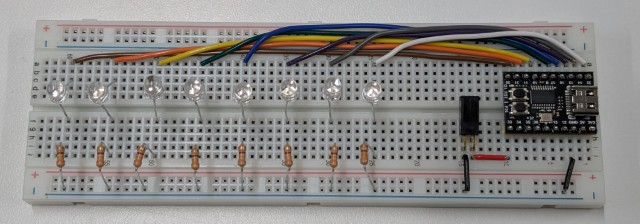

# 「振るLEDディスプレイ」製作

Arduino & CH552マイコンで作る「振るLEDディスプレイ」です。POVとも呼ばれます。

## 目次

- README.md : このファイル
- Arduino : サンプルプログラム
  - Blink : LEDの点滅
  - Tiltsensor : 傾斜センサのテスト
  - POV : 振るLEDディスプレイのサンプルプログラム
- document : ドキュメントやREADMEの画像ファイル

### このページへのリンク

  
[https://github.com/iceetrdi/event_2025-02-07](https://github.com/iceetrdi/event_2025-02-07)

## 製作イメージ

## 使用材料

|物品|概要|個数|
|:----|:----|:----|
|マイコンボード|[WeActStudio.CH552CoreBoard](https://github.com/WeActStudio/WeActStudio.CH552CoreBoard)|1個|
|ブレッドボード|[ZY-102](https://akizukidenshi.com/catalog/g/g130087/)または同等品|1個|
|ジャンパワイヤ|[耐熱通信機器用ビニル電線](https://akizukidenshi.com/catalog/g/g108996/)など|1セット|
|LED|[ESL-R5BUPGC018](https://akizukidenshi.com/catalog/g/g108361/)など|8個|
|傾斜センサ|[RBS040210-G](https://akizukidenshi.com/catalog/g/g111714/)|1個|
|抵抗|[カーボン抵抗(炭素皮膜抵抗) 1/2W330Ω](https://akizukidenshi.com/catalog/g/g107812/)など|8個|
|USBケーブル|[USBケーブル USB2.0 TypeAオス⇔TypeCオス](https://akizukidenshi.com/catalog/g/g113563/)|1本|

## 開発環境

- [Arduino IDE](https://www.arduino.cc/en/software)
- [ch55xduino](https://github.com/DeqingSun/ch55xduino)

### 開発環境構築方法

1. WCH社Webサイトからドライバ [CH372DRV.EXE](https://www.wch-ic.com/downloads/CH372DRV_EXE.html) を入手し、インストールしてください（※）
2. Arduino IDE を入手し、インストールしてください
3. Arduino IDE を起動し、基本設定 ( Ctrl + , ) の「追加のボードマネージャのURL」にch55xduinoを入手するためのURL `https://raw.githubusercontent.com/DeqingSun/ch55xduino/ch55xduino/package_ch55xduino_mcs51_index.json` を入力してください
4. Arduino IDE のボードマネージャから`CH55xDuino MCS51 plain C core (non-C++)`をインストールしてください
5. ボードは、`CH55xDuino MCS51 plain C core (non-C++)` から `CH552 Board` を選択してください

※ このドライバがないとプログラム書き込みに失敗します。代わりに[WCHISPTool](https://www.wch.cn/downloads/WCHISPTool_Setup_exe.html)をインストールしても動作します。
