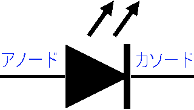

# 発光ダイオード(LED)の使い方

## LEDとは

発光ダイオード(LED: Light Emitting Diode)は光を発する半導体素子で、表示や通信などに良く使われます。
用途に応じて発光する光の波長が異なるLEDを使います。
ダイオード（整流素子）の一種なので、電流を流す向きが決まっています。

- 可視光LED
  - 表示器やディスプレイなどに用います
  - 白色LEDは照明などに使われます
- 赤外線(IR-LED)
  - 主に通信に使われます
  - 暗視カメラの光源に使われることもあります
- 紫外線(UV-LED)
  - ブラックライト用の光源
  - 近年はより波長の短い（エネルギーが大きい）光が出せるものも登場しており、殺菌灯としても活用されます

## 回路図記号と回路設計の仕方

LEDの回路図記号はダイオードの記号に光が出ていく表現の矢印が追加されたものです。
アノードと呼ばれる端子を電源のプラス側、カソードと呼ばれる端子を電源のマイナス側に接続して使います。
電流はアノードからカソードへ流れます。

LEDは電源に直接接続すると、大電流が流れて壊れてしまいます。そのため、電流を制限するため工夫が必要です。一番簡単なのは抵抗を直列接続することです。

## 砲弾型LEDの使い方

LEDには用途に応じて様々な形や大きさのものがあります。このプロジェクトでは個人の電子工作で良く用いられる砲弾型LEDを使います。砲弾型LEDの端子（足）は2本ありますが、それぞれ長さが違います。長い方がアノード、短い方がカソードです。また、多くの場合、砲弾の根本にあるつば部分の切り欠きでも判別ができます。基本的には切り欠きがある方がカソードです。
